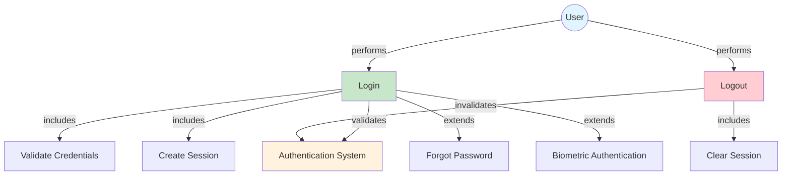

<a href="https://github.com/drshahizan/mobile_apps/stargazers"></a>
<a href="https://github.com/drshahizan/mobile_apps/network/members"></a>
<a href="https://github.com/drshahizan/mobile_apps/pulls"></a>
<a href="https://github.com/drshahizan/mobile_apps/issues"></a>
<a href="https://github.com/drshahizan/mobile_apps/graphs/contributors"></a>


# Login and Logout Use Cases

This document provides comprehensive use case specifications for login and logout functionality in mobile applications. These use cases are essential for implementing user authentication and session management in mobile apps.

## Table of Contents
- [Use Case Diagram](#use-case-diagram)
- [Use Case 1: User Login](#use-case-1-user-login)
- [Use Case 2: User Logout](#use-case-2-user-logout)
- [Security Considerations](#security-considerations)
- [Implementation Guidelines](#implementation-guidelines)

---

## Use Case Diagram

The following diagram illustrates the relationship between actors and use cases for authentication:



---

## Use Case 1: User Login

### UC-001: User Login

**Description:**  
Allows a registered user to authenticate and access the mobile application using their credentials.

**Primary Actor:**  
User (Mobile App User)

**Secondary Actors:**  
- Authentication Server
- Database System
- Notification Service (optional)

**Preconditions:**
- User has already registered an account
- Mobile application is installed and launched
- Device has internet connectivity
- User is not currently logged in

**Trigger:**  
User taps on the "Login" button or navigates to the login screen

---

### Main Success Scenario (Basic Flow)

1. System displays the login screen with username/email and password fields
2. User enters their username or email address
3. User enters their password
4. User taps the "Login" button
5. System validates the input fields (non-empty, correct format)
6. System sends authentication request to the server
7. Server validates credentials against the database
8. Server creates a session token/JWT
9. System receives successful authentication response
10. System stores the session token securely (encrypted storage)
11. System navigates user to the home screen/dashboard
12. System displays a welcome message
13. **Use case ends successfully**

---

### Alternative Flows

#### AF-1: Social Media Login (Extension)
**Trigger:** At step 1, user chooses social media login option

1. System displays social media login options (Google, Facebook, Apple)
2. User selects a social media provider
3. System redirects to the provider's authentication page
4. User authorizes the application
5. System receives authentication token from provider
6. Server validates the token and creates/retrieves user account
7. Continue from step 8 of main flow

#### AF-2: Biometric Authentication (Extension)
**Trigger:** At step 1, biometric option is available and user has enabled it

1. System checks if biometric authentication is enabled
2. System prompts for fingerprint/face recognition
3. User provides biometric input
4. System validates biometric data
5. If successful, continue from step 8 of main flow
6. If failed, system prompts for password login

#### AF-3: Remember Me Feature
**Trigger:** At step 4, user checks "Remember Me" checkbox

1. After successful login (step 10)
2. System stores encrypted credentials in secure storage
3. On subsequent app launches, system auto-fills credentials
4. Continue with normal flow

#### AF-4: First-Time Login
**Trigger:** User is logging in for the first time

1. After step 10, system detects first-time login
2. System displays welcome tutorial/onboarding screens
3. User completes onboarding
4. System marks onboarding as completed
5. Continue to step 11 of main flow

---

### Exception Flows

#### EF-1: Invalid Credentials
**Trigger:** At step 7, credentials are incorrect

1. Server returns authentication failure
2. System displays error message: "Invalid username or password"
3. System clears password field
4. System increments failed login attempt counter
5. If attempts < 3, return to step 2 of main flow
6. If attempts >= 3, system may show CAPTCHA or lock account temporarily
7. **Use case ends in failure**

#### EF-2: Network Connection Error
**Trigger:** At step 6, network is unavailable

1. System detects network connectivity issue
2. System displays error message: "No internet connection. Please check your network settings."
3. System provides "Retry" button
4. If user taps retry and network is available, continue from step 6
5. If user cancels, **use case ends in failure**

#### EF-3: Empty Fields
**Trigger:** At step 5, required fields are empty

1. System validates input fields
2. System highlights empty fields in red
3. System displays error message: "Please fill in all required fields"
4. Return to step 2 of main flow
5. **Use case continues**

#### EF-4: Server Error
**Trigger:** At step 6-9, server returns error (500, 503)

1. System receives server error response
2. System displays error message: "Server temporarily unavailable. Please try again later."
3. System logs error for debugging
4. System provides "Retry" button
5. **Use case ends in failure**

#### EF-5: Account Locked
**Trigger:** At step 7, account is locked due to security reasons

1. Server detects account is locked
2. System displays message: "Your account has been locked due to multiple failed login attempts. Please reset your password or contact support."
3. System provides options: "Reset Password" or "Contact Support"
4. **Use case ends in failure**

#### EF-6: Session Token Error
**Trigger:** At step 10, unable to store session token

1. System fails to store session token
2. System logs out user
3. System displays error: "Login failed. Please try again."
4. Return to step 1 of main flow
5. **Use case ends in failure**

---

### Postconditions

**Success:**
- User is authenticated and logged into the application
- Valid session token is stored securely in device storage
- User is redirected to the home screen or dashboard
- User's login status is persisted across app restarts (if "Remember Me" enabled)
- Login event is logged for analytics and security audit

**Failure:**
- User remains on the login screen
- No session token is created or stored
- Error message is displayed to the user
- Failed login attempt is logged

---

### Special Requirements

**Performance:**
- Login process should complete within 3-5 seconds under normal network conditions
- Biometric authentication should respond within 1-2 seconds

**Security:**
- Passwords must be encrypted during transmission (HTTPS/TLS)
- Session tokens must be stored in encrypted storage (Keychain for iOS, Keystore for Android)
- Implement rate limiting to prevent brute force attacks
- Passwords should never be logged or displayed
- Implement account lockout after multiple failed attempts

**Usability:**
- Clear error messages for all failure scenarios
- Password field should have show/hide toggle
- Support for password managers and autofill
- Responsive design for different screen sizes
- Accessibility support (screen readers, high contrast)

**Data Requirements:**
- Username/Email: 3-255 characters
- Password: 8-128 characters (enforce strong password policy)
- Session token: JWT or secure random token

---

## Use Case 2: User Logout

### UC-002: User Logout

**Description:**  
Allows an authenticated user to securely terminate their session and exit the application.

**Primary Actor:**  
Authenticated User

**Secondary Actors:**  
- Authentication Server
- Session Management System
- Local Storage

**Preconditions:**
- User is currently logged in
- Valid session token exists
- User is on any screen within the application

**Trigger:**  
User taps on the "Logout" button or selects "Logout" from the menu

---

### Main Success Scenario (Basic Flow)

1. User navigates to the profile/settings menu
2. User taps the "Logout" button
3. System displays a confirmation dialog: "Are you sure you want to logout?"
4. User confirms logout action
5. System sends logout request to the server with session token
6. Server invalidates the session token
7. System receives successful logout response
8. System clears session token from secure storage
9. System clears any cached user data (if applicable)
10. System clears navigation stack
11. System redirects user to the login screen
12. System displays confirmation message: "You have been logged out successfully"
13. **Use case ends successfully**

---

### Alternative Flows

#### AF-1: Auto-Logout (Timeout)
**Trigger:** User has been inactive for a predefined period

1. System detects user inactivity timeout (e.g., 15 minutes)
2. System automatically initiates logout process
3. System displays notification: "Your session has expired due to inactivity"
4. Continue from step 5 of main flow

#### AF-2: Logout from Multiple Devices
**Trigger:** User selects "Logout from all devices" option

1. At step 2, user selects "Logout from all devices"
2. System displays warning: "This will logout from all devices. Continue?"
3. User confirms action
4. System sends request to invalidate all active sessions for the user
5. Server invalidates all session tokens associated with the user
6. Continue from step 7 of main flow

#### AF-3: Forced Logout (Security)
**Trigger:** Server detects suspicious activity or security breach

1. Server sends push notification to force logout
2. System receives forced logout command
3. System displays message: "For security reasons, you have been logged out. Please login again."
4. Continue from step 5 of main flow (skip user confirmation)

#### AF-4: Logout Without Confirmation
**Trigger:** User has disabled logout confirmation in settings

1. User taps "Logout" button
2. System skips confirmation dialog
3. Continue from step 5 of main flow

---

### Exception Flows

#### EF-1: Network Error During Logout
**Trigger:** At step 5, network is unavailable

1. System detects network connectivity issue
2. System proceeds with local logout anyway
3. System clears local session token and data
4. System queues logout request for when network is available
5. Continue from step 8 of main flow
6. System displays message: "Logged out locally. Connection will be cleared when online."
7. **Use case ends successfully** (graceful degradation)

#### EF-2: Server Error During Logout
**Trigger:** At step 6, server returns error

1. Server fails to invalidate session
2. System receives error response
3. System logs the error
4. System proceeds with local logout anyway
5. Continue from step 8 of main flow
6. System displays message: "Logged out locally"
7. **Use case ends successfully** (graceful degradation)

#### EF-3: User Cancels Logout
**Trigger:** At step 4, user cancels the action

1. User taps "Cancel" on confirmation dialog
2. System dismisses the dialog
3. User remains logged in
4. System returns to previous screen
5. **Use case ends** (no action taken)

#### EF-4: Storage Access Error
**Trigger:** At step 8, system cannot access secure storage

1. System fails to clear session token
2. System logs the error
3. System attempts alternative cleanup methods
4. System may request app reinstallation if persistent
5. Continue to step 11 of main flow
6. **Use case ends with warning**

---

### Postconditions

**Success:**
- User session is terminated on the server
- Session token is removed from local secure storage
- All cached user data is cleared
- User is redirected to the login screen
- User cannot access protected resources without re-authenticating
- Logout event is logged for security audit

**Failure:**
- If server logout fails but local logout succeeds:
  - User is logged out locally
  - Session may remain active on server (will expire naturally)
  - User sees logged-out state
  
**Partial Success (Network Error):**
- User is logged out locally
- Session cleanup is queued for next network availability
- User cannot access app without re-logging in

---

### Special Requirements

**Performance:**
- Logout process should complete within 2-3 seconds
- Local cleanup should happen immediately even if server communication fails

**Security:**
- All sensitive data must be cleared from device memory
- Session token must be securely deleted (not just marked as deleted)
- Navigation history should be cleared to prevent back-button access
- Cached API responses with sensitive data should be cleared

**Usability:**
- Confirmation dialog to prevent accidental logout
- Clear visual feedback during logout process
- Option to disable confirmation for power users
- Smooth transition to login screen

**Data Requirements:**
- Session token must be invalidated on server
- User preferences may be retained (optional, based on app requirements)
- Locally cached non-sensitive data may be retained for performance

---

## Security Considerations

### Authentication Security

1. **Password Security**
   - Never store passwords in plain text
   - Use strong hashing algorithms (bcrypt, Argon2)
   - Enforce password complexity requirements
   - Implement password expiration policies (optional)

2. **Session Management**
   - Use secure, randomly generated session tokens
   - Implement token expiration (access tokens: 15-60 mins, refresh tokens: 7-30 days)
   - Use refresh token rotation
   - Invalidate tokens on logout

3. **Network Security**
   - Always use HTTPS/TLS for all authentication requests
   - Implement certificate pinning for critical operations
   - Validate SSL certificates

4. **Device Security**
   - Store tokens in platform-specific secure storage (Keychain/Keystore)
   - Use encryption for sensitive data at rest
   - Clear sensitive data from memory after use

5. **Attack Prevention**
   - Implement rate limiting (e.g., max 5 login attempts per minute)
   - Use CAPTCHA after multiple failed attempts
   - Implement account lockout after repeated failures
   - Monitor for brute force attacks

6. **Multi-Factor Authentication (MFA)**
   - Support 2FA/MFA for additional security
   - SMS OTP, Email OTP, or Authenticator apps
   - Biometric authentication as second factor

---

## Implementation Guidelines

### For Flutter Development

#### 1. State Management
```dart
// Use secure storage for tokens
import 'package:flutter_secure_storage/flutter_secure_storage.dart';

class AuthService {
  final storage = FlutterSecureStorage();
  
  Future<void> saveToken(String token) async {
    await storage.write(key: 'auth_token', value: token);
  }
  
  Future<String?> getToken() async {
    return await storage.read(key: 'auth_token');
  }
  
  Future<void> deleteToken() async {
    await storage.delete(key: 'auth_token');
  }
}
```

#### 2. API Integration
```dart
// Login API call
Future<bool> login(String email, String password) async {
  try {
    final response = await http.post(
      Uri.parse('$baseUrl/auth/login'),
      headers: {'Content-Type': 'application/json'},
      body: json.encode({
        'email': email,
        'password': password,
      }),
    );
    
    if (response.statusCode == 200) {
      final data = json.decode(response.body);
      await saveToken(data['token']);
      return true;
    }
    return false;
  } catch (e) {
    // Handle network errors
    return false;
  }
}

// Logout API call
Future<bool> logout() async {
  try {
    final token = await getToken();
    final response = await http.post(
      Uri.parse('$baseUrl/auth/logout'),
      headers: {
        'Content-Type': 'application/json',
        'Authorization': 'Bearer $token',
      },
    );
    
    await deleteToken();
    return response.statusCode == 200;
  } catch (e) {
    // Even if server logout fails, clear local data
    await deleteToken();
    return true; // Graceful degradation
  }
}
```

#### 3. UI Components
```dart
// Login Screen Widget
class LoginScreen extends StatefulWidget {
  @override
  _LoginScreenState createState() => _LoginScreenState();
}

class _LoginScreenState extends State<LoginScreen> {
  final _formKey = GlobalKey<FormState>();
  final _emailController = TextEditingController();
  final _passwordController = TextEditingController();
  bool _isLoading = false;
  bool _obscurePassword = true;

  @override
  Widget build(BuildContext context) {
    return Scaffold(
      body: Form(
        key: _formKey,
        child: Column(
          children: [
            TextFormField(
              controller: _emailController,
              decoration: InputDecoration(labelText: 'Email'),
              validator: (value) {
                if (value == null || value.isEmpty) {
                  return 'Please enter your email';
                }
                return null;
              },
            ),
            TextFormField(
              controller: _passwordController,
              decoration: InputDecoration(
                labelText: 'Password',
                suffixIcon: IconButton(
                  icon: Icon(_obscurePassword ? Icons.visibility : Icons.visibility_off),
                  onPressed: () {
                    setState(() {
                      _obscurePassword = !_obscurePassword;
                    });
                  },
                ),
              ),
              obscureText: _obscurePassword,
              validator: (value) {
                if (value == null || value.isEmpty) {
                  return 'Please enter your password';
                }
                return null;
              },
            ),
            ElevatedButton(
              onPressed: _isLoading ? null : _handleLogin,
              child: _isLoading ? CircularProgressIndicator() : Text('Login'),
            ),
          ],
        ),
      ),
    );
  }

  Future<void> _handleLogin() async {
    if (_formKey.currentState!.validate()) {
      setState(() => _isLoading = true);
      
      final success = await login(
        _emailController.text,
        _passwordController.text,
      );
      
      setState(() => _isLoading = false);
      
      if (success) {
        Navigator.pushReplacementNamed(context, '/home');
      } else {
        ScaffoldMessenger.of(context).showSnackBar(
          SnackBar(content: Text('Login failed. Please try again.')),
        );
      }
    }
  }
}
```

#### 4. Biometric Authentication
```dart
import 'package:local_auth/local_auth.dart';

class BiometricAuth {
  final LocalAuthentication auth = LocalAuthentication();
  
  Future<bool> authenticateWithBiometrics() async {
    try {
      final bool canAuthenticateWithBiometrics = await auth.canCheckBiometrics;
      final bool canAuthenticate = canAuthenticateWithBiometrics || await auth.isDeviceSupported();
      
      if (!canAuthenticate) {
        return false;
      }
      
      return await auth.authenticate(
        localizedReason: 'Please authenticate to login',
        options: const AuthenticationOptions(
          stickyAuth: true,
          biometricOnly: true,
        ),
      );
    } catch (e) {
      return false;
    }
  }
}
```

#### 5. Session Timeout Handler
```dart
class SessionManager {
  Timer? _sessionTimer;
  final int timeoutMinutes = 15;
  
  void startSession() {
    resetTimer();
  }
  
  void resetTimer() {
    _sessionTimer?.cancel();
    _sessionTimer = Timer(Duration(minutes: timeoutMinutes), _handleTimeout);
  }
  
  void _handleTimeout() {
    // Auto logout
    logout();
    // Navigate to login
    navigatorKey.currentState?.pushReplacementNamed('/login');
    // Show message
    showSnackBar('Session expired due to inactivity');
  }
  
  void endSession() {
    _sessionTimer?.cancel();
  }
}
```

---

### Testing Checklist

#### Login Testing
- [ ] Valid credentials login successfully
- [ ] Invalid credentials show error message
- [ ] Empty fields validation
- [ ] Network error handling
- [ ] Server error handling
- [ ] Password visibility toggle works
- [ ] Social media login (if implemented)
- [ ] Biometric authentication (if implemented)
- [ ] Remember me functionality
- [ ] Account lockout after failed attempts
- [ ] First-time login flow
- [ ] Session persistence

#### Logout Testing
- [ ] Logout with confirmation works
- [ ] Cancel logout keeps user logged in
- [ ] Session cleared from server
- [ ] Local token removed
- [ ] Cached data cleared
- [ ] Navigation stack cleared
- [ ] Auto-logout on timeout
- [ ] Logout with network error
- [ ] Logout from all devices
- [ ] Forced logout
- [ ] Back button doesn't return to protected screens

---

## Best Practices

1. **User Experience**
   - Provide clear, actionable error messages
   - Show loading indicators during async operations
   - Implement smooth transitions between screens
   - Support both email and username login
   - Offer password reset functionality

2. **Security**
   - Never log sensitive information
   - Use environment variables for API endpoints
   - Implement proper error handling without exposing system details
   - Regular security audits
   - Keep dependencies updated

3. **Performance**
   - Cache non-sensitive data appropriately
   - Minimize API calls
   - Optimize image and asset loading
   - Implement proper loading states

4. **Accessibility**
   - Support screen readers
   - Proper contrast ratios
   - Keyboard navigation support
   - Text scaling support
   - Meaningful labels for form fields

5. **Analytics & Monitoring**
   - Log authentication events (without sensitive data)
   - Monitor failed login attempts
   - Track session durations
   - Monitor API performance
   - Set up alerts for unusual patterns

---

## Related Resources

- [Flutter Secure Storage Package](https://pub.dev/packages/flutter_secure_storage)
- [Local Authentication Package](https://pub.dev/packages/local_auth)
- [HTTP Package](https://pub.dev/packages/http)
- [Provider State Management](https://pub.dev/packages/provider)
- [OAuth 2.0 Specification](https://oauth.net/2/)
- [JWT Best Practices](https://tools.ietf.org/html/rfc8725)

---

## Contribution 🛠️
Please create an [Issue](https://github.com/drshahizan/mobile_apps/issues) for any improvements, suggestions or errors in the content.

You can also contact the maintainer using [LinkedIn](https://www.linkedin.com/in/drshahizan/) for any other queries or feedback.

[](https://visitorbadge.io/status?path=https%3A%2F%2Fgithub.com%2Fdrshahizan)

